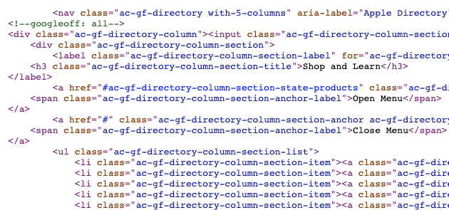
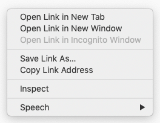
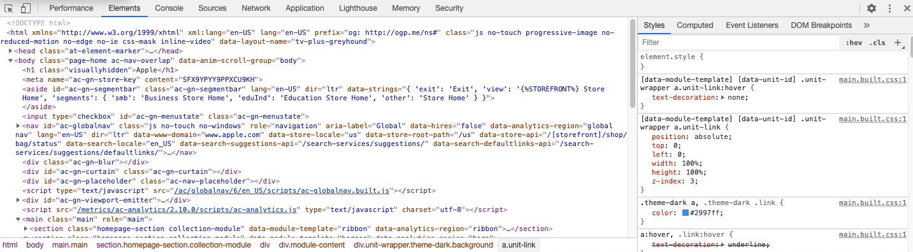

# WEB Development : Kicking the tyres

If you're reading this in 2020, I don't think I need to talk about how prevalent the internet is. You're probably reading this online on a web browser. This website is teaching you how to make more of its kind! Isn't that wonderful? Before we begin, I want to address some common questions that I think you might have.

**But I already know of this app (Squarespace, WIX) etc, which make making websites so much more easier! Why should I care about learning all these things**

You're right! These websites builders are amazing. They have beautiful templates to get you started, they're customizable and fairly easy to learn. But if you think of making websites as a creative tool (which it is!), then these services are fairly restrictive. Imagine trying to make an oil painting with a bunch of stencils or stickers. It'd be difficult to achieve what you're aiming for with a limited set to tools.

**But I don't like coding**

Coding can be frustrating sometimes, I don't blame you. For all the amazing things that the computers can do, they're pretty dumb. You have to write instructions for each and every step to make it work. And simple mistakes like a missing punctuation can completely break the code.

But as you practice, you'll get a hang of it. It's like riding a bicycle. So, hang on! Also we'll discuss only HTML, CSS in this course which are not programming languages in strict sense. If you guys like this, then I can probably make a lesson on JavaScript as well.

**Who should read this lesson?**

This lesson is as basic as it gets! If you have NEVER tried web development and words like HTML, CSS make no sense to you, then this lesson is for you. I have also geared this course for a much younger audience.

---

## Components of a page

A typical web page has three distinct files associated with it:

- **HTML** (HyperText Markup Language) : This file has all the text on the page. But since a page has multiple parts (navigation, heading, paragraph etc,) the text is segregated using HTML tags. More on this later.
- **CSS** (Cascading Style Sheets) : This file is used to define the "styles" of the HTML document. If you want to set the background of your file to red or the font size to 12px, or perhaps using a funny font for your website, you can write all that in this file.
- **JS** (JavaScript) : JavaScript is a programming language (a scripting language is the technically correct term for JS) used to interact with HTML. When you shop online, you must have noticed a tiny shopping cart on top right. When you add something to your cart, the number on the cart changes. Interactions like these are achieved with JavaScript.

---

## Section 1: Lets look at some source code.

For this task, and the remainder of the lesson, I'd suggest you to use Google Chrome. It is one of the most popular web browsers out there and has developer friendly tools built into it. If you don't have it on your computer, please [install Google Chrome](https://www.google.com/chrome/) before continuing.

Lets go to apple.com, and look at its source code.

If you have an apple computer, look for "View" menu at the top of the browser, then navigate to View > Developer > Source code.

For Windows computer, right click on the page, and click on "View Page Source" And this is what an HTML file looks like:



An HTML page is made up of a lot of tags. Some tags have text in them, and others have more tags inside them. But what is a tag? A typical tag is structured like this:

```html
<p>Hello World!</p>
```

This is a p tag. There are many other like it like div, h1, ul etc. And they all have different use cases.
Tag starts with the tag name(p) enclosed in angle brackets(<,>) and ends with a closing tag, which is similar but has a forward slash as well.

Scroll down the file and look for familiar english words in the file, you should be able to spot some familiar text from the website.

> _**Task!**: Use the search feature (Ctrl/Cmd + F) to find the text "iPhone 11". Read the HTML tags and text around this text._ The HTML file contains all the text which is visible on the page, and the tags are used to structure it.

## Section 2: Lets hack HTML

- Next, lets checkout the Chrome Developer tools. Right click on the page and click on "Inspect"

  

- You should see the following window open in your browser. This window is called DevTools

  

  Devtools is a complicated looking tool, but it's pretty useful. The text on the left is the HTML file of this web page.
